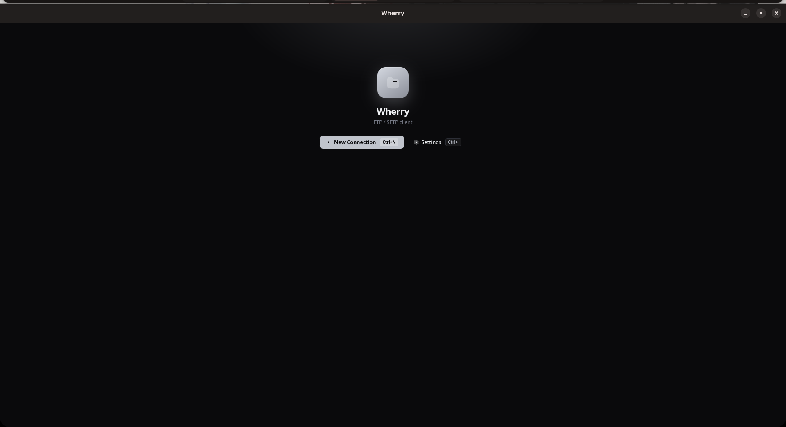
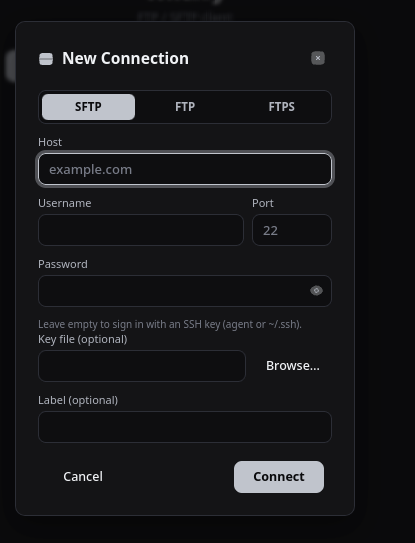
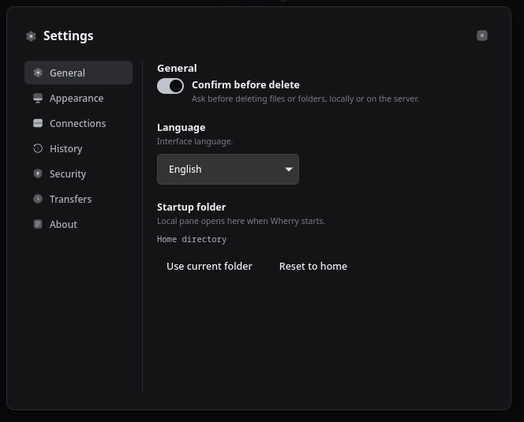

# Wherry


FTP/SFTP клиент на Tauri 2: бэкенд на Rust, фронтенд — vanilla HTML/CSS/JS.

<p align="center">
  
  <br><em>Welcome-экран с сохранёнными сайтами и историей подключений</em>
</p>

## Стек

- **Tauri 2** — нативная оболочка (Rust-бэкенд + WebView-фронтенд)
- **tokio** — async runtime
- **ssh2** / **suppaftp** — протоколы SFTP / FTP(S)
- **rusqlite** — локальное хранилище (сайты, история, закладки, настройки)
- **системный keychain** — хранение паролей (UI их не читает)
- фронтенд — чистые HTML/CSS/JS без сборщика, i18n на 12 языков

## Протоколы

| Протокол | Статус       |
|----------|--------------|
| SFTP     | реализован   |
| FTP      | реализован   |
| FTPS     | реализован   |

## Скриншоты

<p align="center">
  
  
  <br><em>Диалог подключения (слева) и окно настроек (справа)</em>
</p>

## Возможности

- Chunked upload/download с событиями прогресса
- Pause/cancel в очереди передач
- Операции над удалёнными файлами: новая папка / удалить / переименовать
- Drag & drop, горячие клавиши (Cmd/Ctrl в зависимости от платформы)
- Welcome-экран: сохранённые сайты, недавние подключения, шорткаты
- Settings: General / Appearance / Connections / History / Security / Transfers / About

## Разработка

```bash
# запуск в dev-режиме (нужен tauri-cli: cargo install tauri-cli)
cargo tauri dev

# обычная сборка Rust-крейта
cargo build
```

## Архитектура

```
src/                    -- Rust-бэкенд (Tauri)
├── domain/             -- модели данных (Connection, FileEntry, TransferTask, Site)
├── protocols/           -- RemoteFs trait + sftp/, ftp/
├── transfer/            -- очередь, воркер, прогресс
├── storage/             -- SQLite (sites, history, bookmarks, settings) + keychain (пароли)
├── fs/                   -- локальная ФС + реестр удалённых соединений
├── i18n/                 -- строки для бэкенда
├── commands.rs           -- Tauri-команды (IPC для фронтенда)
├── lib.rs / main.rs      -- точки входа
└── tauri.conf.json       -- конфигурация приложения

frontend/               -- фронтенд (vanilla JS, без сборщика)
├── js/
│   ├── components/       -- UI-компоненты
│   ├── i18n/              -- локали (en, ru, de, fr, es, it, pt, pl, tr, ja, ko, zh)
│   ├── ipc.js              -- обёртка над Tauri IPC
│   └── main.js             -- точка входа
└── css/                  -- theme, layout, components
```

## Лицензия

GPL-3.0-only, см. [LICENSE](LICENSE).
